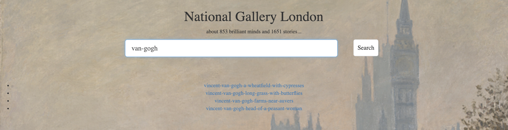

<h3 align="center">

 ✨ Welcome to Baibai's Dream Gallery ✨ 
 
</h3>

[Visit my website](https://eveneveno.github.io/DearGallery/)

> a girl who likes collectings dreams ...

<h3 align="center">

</h3>

#### 🧸 Data Sources 

 All the collected meta info are obtained from [National Galllery London](https://www.nationalgallery.org.uk/paintings/). The paintings are downloaded with low resolution for personal study interest.

#### 🧸 How to search

Type in the formated query `author`-`title`. Here are some examples:
> sandro-botticelli-venus-and-mars
> vincent-van-gogh-long-grass-with-butterflies
> joseph-mallord-william-turner-dutch-boats-in-a-gale-the-bridgewater-sea-piece
> claude-monet-the-thames-below-westminster

If you are not sure about the full name, just type in some keywords of the artist or the title, the search bar will pop out autocompleting candidates  for you. 

If you want to see some of Van Gogh's artworks that are available in National Gallery London, but not knowing the names, you can just type in `van-gogh` for search. The window below will list all matched artworks that belong to `van-gogh`.

<h3 align="center">

</h3>
 

###### 🧸 Anecdote ... 

There is an (invisible) audio player locate above the title <strong> National Gallery London</strong>, click it and enjoy your surfer. The song is Ed Sheeran's [Supermarket Flowers](https://www.youtube.com/watch?v=bIB8EWqCPrQ). Every morning I woke up in my bed with this 🎵, peaceful and joyful. I believe you will love it while browsing these amazing paintings, with the magic to bring you to the past. 
